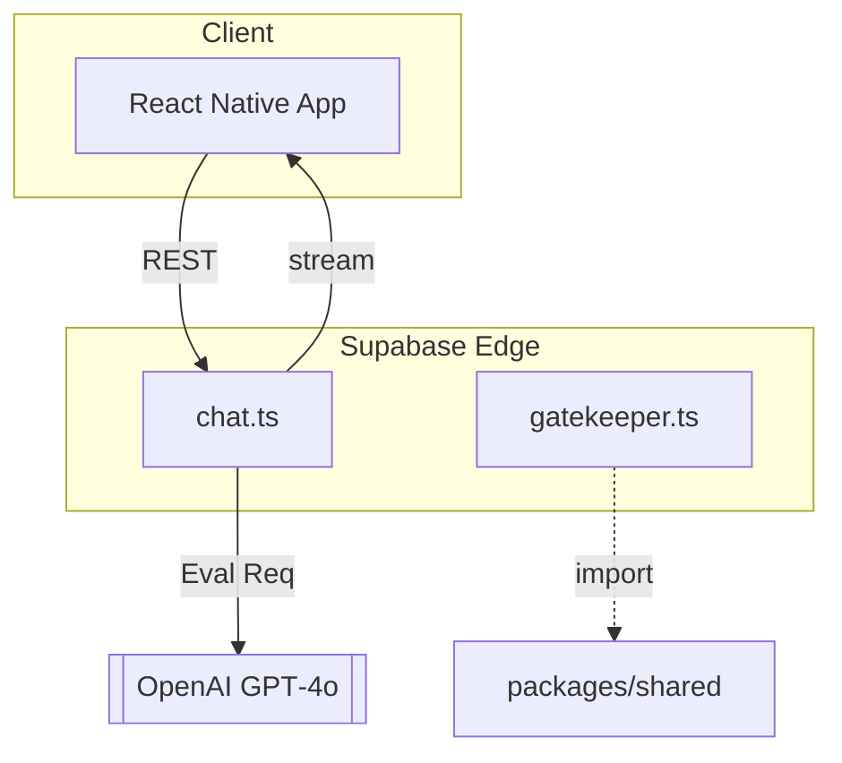

# 🏛️ System Architecture

```mermaid
flowchart TD
  subgraph Client
    RN[React Native App]
  end
  subgraph Edge[Supabase Edge]
    ChatFn[chat.ts]
    GateFn[gatekeeper.ts]
  end
  OpenAI[[OpenAI GPT‑4o]]
  RN -- REST --> ChatFn
  ChatFn -- stream --> RN
  ChatFn -- Eval Req --> OpenAI
  GateFn -. import .-> Shared[packages/shared]
```

## 📡 Data Flow

1. **User → RN**: テキスト発話
2. **RN → ChatFn**: `/chat` POST
3. **ChatFn**: 語彙チェック → OpenAI → 評価付応答
4. **RN**: 画面描画 & スコア
