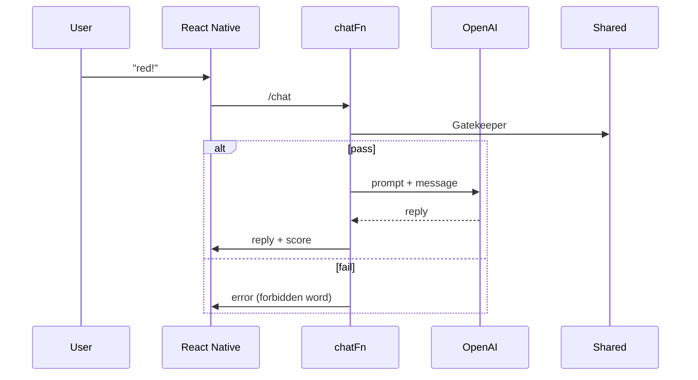

# 📝 Baby‑English MVP — System Design Document

> Version 0.1  (2025‑05‑04)

---

## 0. Document Purpose

本書は **Baby‑English MVP** の機能説明・システム構成・開発ガイドラインを統合した設計書です。新規参画メンバーや AI アシスタント (Devin, Cursor) が最短で開発に着手できることを目的とします。

---

## 1. Product Vision

* **Problem**: 日本の英語初心者は“読む・翻訳”中心で、思考を英語化する実践機会が乏しい。
* **Solution**: 0 歳から英語世界をシミュレートし、語彙・文法を年齢成長と紐付けて段階的に解放するゲーム的学習体験。
* **Goal (MVP)**: 12 週以内に β テスター 50 人が毎日 5 分以上利用し、NPS ≥ 20 を達成。

---

## 2. Functional Requirements

| ID   | 機能        | 優先度 | 説明                                 |
| ---- | --------- | --- | ---------------------------------- |
| FR‑1 | アカウント匿名登録 | ★★★ | 初回起動時に UUID を発行し Supabase Auth へ登録 |
| FR‑2 | チャット学習    | ★★★ | LLM とテキストチャット。語彙ゲート + 自動採点         |
| FR‑3 | ミッション UI  | ★★☆ | 色・数字・挨拶の 3 ミッションをタブ表示              |
| FR‑4 | 年齢メーター    | ★★☆ | スコア条件達成でレベルアップ演出                   |
| FR‑5 | 学習ログ一覧    | ★★☆ | セッション履歴を確認 (日付・スコア)                |
| FR‑6 | 管理ダッシュボード | ★☆☆ | Supabase Studio で閲覧。β段階は UI 開発しない  |

---

## 3. User Stories (主要のみ)

* **U‑1**: *As a* beginner, *I want* to ask “red?” and get confirmation, *so that* I gain confidence using simple words.
* **U‑2**: *As a* user who cleared colors mission, *I want* to see my age increase, *so that* I feel progression.
* **U‑3**: *As a* tester, *I want* to export chat logs, *so that* I can share feedback with devs.

---

## 4. System Components

| Component                    | Tech                  | Responsibilities                              |
| ---------------------------- | --------------------- | --------------------------------------------- |
| **Mobile App**               | React Native Expo     | UI, local cache, auth, fetch wrapper          |
| **Edge Function `chat`**     | Deno TS               | Gatekeeper check → OpenAI call → scorer       |
| **Edge Function `missions`** | Deno TS               | Return mission list & vocab for current level |
| **Supabase Postgres**        | SQL                   | users, sessions, messages, scores             |
| **OpenAI**                   | GPT‑4o, Responses API | Chat generation & evaluation                  |
| **Shared Lib**               | TS Package            | CEFR lists, zod schemas, API types            |

---

## 5. Data Model (DDL excerpt)

```sql
create table users (
  id uuid primary key default gen_random_uuid(),
  created_at timestamptz default now(),
  age_level int not null default 0
);

create table sessions (
  id uuid primary key default gen_random_uuid(),
  user_id uuid references users(id),
  started_at timestamptz default now(),
  ended_at timestamptz
);

create table messages (
  id uuid primary key default gen_random_uuid(),
  session_id uuid references sessions(id),
  role text,  -- 'user' | 'assistant'
  content text,
  token_count int,
  created_at timestamptz default now()
);

create table scores (
  id uuid primary key default gen_random_uuid(),
  session_id uuid references sessions(id),
  mission text,
  target_words text[],
  success bool,
  score int
);
```

---

## 6. API Specification

### 6.1 POST `/chat`

| Field       | Type   | Required | Description     |
| ----------- | ------ | -------- | --------------- |
| `sessionId` | UUID   | ✓        | Current session |
| `message`   | string | ✓        | User utterance  |

Response

```jsonc
{
  "reply": "Yes, red!",
  "evaluation": { "targetMet": true, "score": 5 },
  "tokens": 17
}
```

### 6.2 GET `/missions`

Return current missions & vocab list for the user’s age.

---

## 7. Sequence Diagram (Mission Clear)



---

## 8. Non‑functional Requirements

* **Performance**: End‑to‑end latency < 800 ms P95 at 4G.
* **Cost**: LLM 月額コスト ≤ \$50 at 50 testers (avg 10 prompts/day).
* **Security**: LLM key stored in Supabase secrets; JWT enforced except during local dev.
* **Compliance**: COPPA is out‑of‑scope for MVP (adult testers only).

---

## 9. Development Guide (Quick Ref)

* **Setup**: follow `docs/Setup.md`.
* **Branch**: create `feat/*`. Use `pnpm dev` for dual‑server.
* **Generate EdgeFn**: `supabase functions new <name>`.
* **Run Tests**: `pnpm test`.
* **Lint Fix**: `pnpm lint --fix`.
* **Cursor**: load `project-rules.mdc` before code generation.

---

## 10. Milestone Plan (12 Weeks)

| Week | Deliverable                       |
| ---- | --------------------------------- |
| 1    | Repo scaffold, workspace CI green |
| 2    | DB schema, Auth flow              |
| 3–4  | Chat UI stub + /chat EdgeFn       |
| 5    | Gatekeeper + vocab YAML           |
| 6    | Mission UI & scorer               |
| 7    | Level‑up animation, localizations |
| 8    | Closed β (10 users)               |
| 9    | KPIs dashboard                    |
| 10   | Payment POC                       |
| 11   | Bug‑fix, polish                   |
| 12   | Public β launch                   |

---

## 11. Risk Matrix

| Risk              | Likelihood | Impact | Mitigation                  |
| ----------------- | ---------- | ------ | --------------------------- |
| LLM コスト超過         | M          | H      | Token budget, short prompts |
| iOS AppStore 審査遅延 | M          | M      | 2 週前に TestFlight 提出         |
| Supabase 無料枠制限    | L          | M      | 予算監視, Paid plan fallback    |

---

## 12. Glossary

* **Gatekeeper**: 語彙制限フィルター。
* **Age Level**: アプリ独自レベル (0–18)。
* **Mission**: 学習課題ユニット (色, 数字, 挨拶)。
